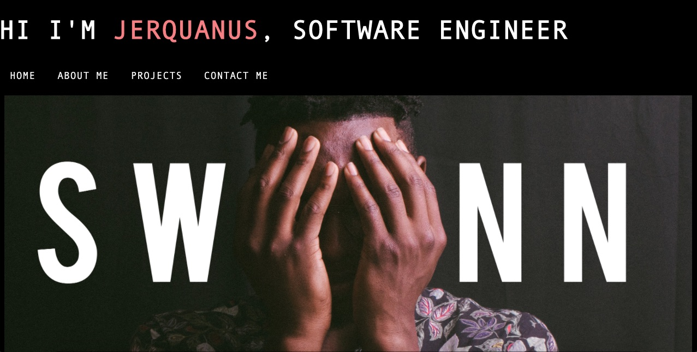

Jerquanus' Portfolio Excercise

Installation:

In order to install excercise - please install visual studio code before continuing.
Open folder and the index.html file will hold the excercise's html code. 
The assets folder will hold the css code neccesary for the html to function properly.

Usage:

For this project the goal was to create a useable portfolio with reactive elements
and the ability to changes size. 

I happened to have an older twitter header handy so I used that as a banner.
My goal was to add a reactive sticky nav bar but failed. So I settled for a just a reactive
nav bar then added my own features to it. 

I used this project to practice my flexbox abilites. I put my main content in a 
flex box to give me more control. Then placed my projects in a flexbox as well. I'm
hoping that helps me in the future when we update the portfolio. 

I also used materalize to help me with creating cards. I'd like to create a better looking card in the future but this suffices for now.

Technologies Used:

Materalize

Credits:
Sticky nav bar Tutorial by RUST CODE: https://www.youtube.com/watch?v=eOfJVWUYoDI

LICENSE:
Feel free to experiment. 

